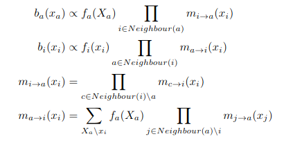
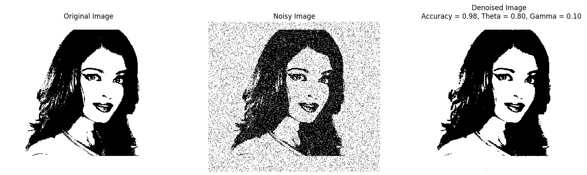

# Loopy Belief Propagation for Binary Image Denoising

An implementation of loopy belief propagation for binary image denoising. Both sequential and parallel updates are implemented.

## Theory

Loopy Belief Propagation allows us to perform approximate inference on a grid structured Markov Network. 

Using a Bethe Cluster Graph representation, the message update equations are as follows:

   

The messages can be passed sequentially or parallely.

## Implementation

In practice, the parallel messages are sent in 4 phases - Right, Left, Up, Down. This considerably faster than sequential message passing.

For running loopy belief propagation using parallel message passing, run 

`python3 loopy_bp.py -p PATH TO IMAGE/CSV -m MODE sync -n ADD EXTERNAL NOISE (True or False, for testing purposes)`

## Results

Results on a sample image are shown below:

   

